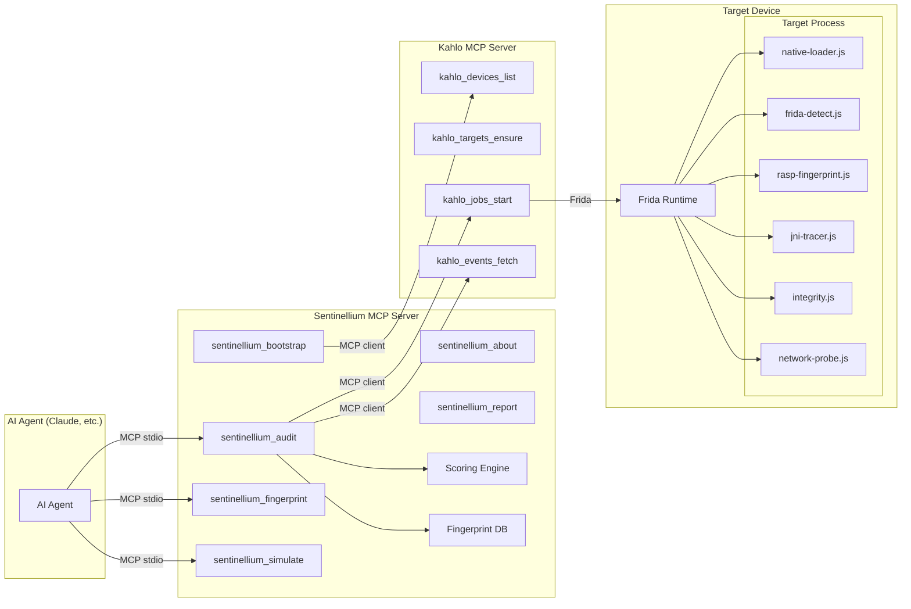

# Sentinellium

A modular RASP auditing framework for Android and iOS. Built as an MCP server on top of [Kahlo](https://github.com/FuzzySecurity/kahlo-mcp) — Sentinellium gives AI agents the tools to orchestrate RASP (Runtime Application Self-Protection) audits without reimplementing Frida plumbing.

Sentinellium also ships a standalone Frida agent + Python host for direct instrumentation without Kahlo. The Kahlo integration adds orchestration, module management, and MCP-native tool access.

## Architecture



**Data flow:** An AI agent calls Sentinellium MCP tools over stdio. Sentinellium acts as an MCP *client* to Kahlo, which manages Frida devices, targets, and jobs. Detection modules are vanilla JS files that run inside Kahlo's job runtime using the `ctx` API (`ctx.emit()`, `ctx.params`, `ctx.heartbeat()`). Events flow back through Kahlo to Sentinellium's scoring engine, which computes a 0–100 risk score.

## Why Kahlo?

Sentinellium's standalone Frida agent works, but building on Kahlo provides:

- **Device & session lifecycle** — Kahlo handles USB/network device management, attach/spawn, session recovery. Sentinellium doesn't reimplement any of this.
- **Job runtime** — Modules run as Kahlo jobs with built-in heartbeat monitoring, event persistence, and cancellation. No custom IPC needed.
- **MCP-native** — Both Kahlo and Sentinellium speak MCP. An AI agent connects to Sentinellium, which connects to Kahlo — clean separation of concerns.
- **Module store** — Kahlo's draft→promote workflow lets modules be versioned and registered independently from the orchestration layer.

## Module Reference

| Module | Job Type | Key Hooks | RASP Feature Audited |
|--------|----------|-----------|---------------------|
| `native-loader.js` | daemon | `android_dlopen_ext` via linker64/linker | Tamper detection, library injection |
| `frida-detect.js` | oneshot | /proc/self/maps, port 27042, trampolines, threads | Anti-instrumentation surface mapping |
| `rasp-fingerprint.js` | oneshot | Process.enumerateModules(), Java class scan | RASP SDK identification |
| `jni-tracer.js` | daemon | `art::JNI::Call*MethodV` ART symbols | Native call surface, RASP check discovery |
| `integrity.js` | daemon | .text section SHA-256 baseline + periodic re-check | Code integrity, anti-patching |
| `network-probe.js` | daemon | libc `connect()`, sockaddr_in parsing | C2 detection, hardcoded IP flagging |

All modules are vanilla JS — no imports, no require(). They use Kahlo's `ctx` API:
- `ctx.emit(level, payload)` — send events (level: "info", "warn", "error")
- `ctx.params` — receive configuration from the orchestrator
- `ctx.heartbeat()` — signal liveness for daemon modules
- `ctx.stdlib.*` — access Kahlo standard library (device info, etc.)

## MCP Tools

| Tool | Description |
|------|-------------|
| `sentinellium_about` | Tool inventory, module descriptions, RASP glossary |
| `sentinellium_bootstrap` | Register all JS modules in Kahlo's module store |
| `sentinellium_audit` | Full audit: fingerprint → detect → score (returns risk score + breakdown) |
| `sentinellium_fingerprint` | Quick RASP SDK identification with confidence score |
| `sentinellium_report` | Format audit results as JSON or Markdown |
| `sentinellium_simulate` | Real-time RASP simulation with configurable kill/log policy |

## Quick Start

### Prerequisites

- Node.js 18+
- Kahlo MCP server ([FuzzySecurity/kahlo-mcp](https://github.com/FuzzySecurity/kahlo-mcp))
- Android device/emulator with `frida-server` running

### Installation

```bash
cd mcp-server
npm install
npm run build
```

### Usage

#### Workflow 1: Quick RASP Identification

```
1. Connect to Sentinellium MCP server
2. Call sentinellium_fingerprint with device_id and package_name
3. Get back: SDK name, confidence score, matched indicators
```

Example response:
```json
{
  "identification": {
    "sdk_id": "wultra",
    "display_name": "Wultra In-App Protection",
    "confidence": 85,
    "matched_indicators": ["native_lib:libwultraappprotection.so", "java_class:io.wultra.app.protection.*"]
  }
}
```

#### Workflow 2: Full RASP Audit

```
1. Call sentinellium_bootstrap to register modules in Kahlo
2. Call sentinellium_audit with device, package, and duration
3. Call sentinellium_report to format results as Markdown
```

The audit runs all detection modules, collects events for the specified duration, computes a risk score, and returns a structured breakdown:

```
Risk Score: 75/100 (HIGH)

| Module           | Events | Errors | Warnings | Info | Score |
|------------------|--------|--------|----------|------|-------|
| frida-detect     | 6      | 1      | 4        | 1    | 40    |
| integrity        | 3      | 1      | 0        | 2    | 25    |
| jni-tracer       | 3      | 0      | 2        | 1    | 10    |
| native-loader    | 5      | 1      | 0        | 4    | 25    |
```

#### Workflow 3: RASP Simulation

```
1. Call sentinellium_simulate with policy: "strict" or "monitor"
2. Strict: critical findings → target detach (simulates app kill)
3. Monitor: observe all events without intervention
```

This tests how effectively a RASP would respond to the current instrumentation. If the app survives strict mode, your stealth setup is working.

## Configuration

### Audit Parameters (`config/default-audit.yaml`)

Controls which modules run, their parameters, and scoring weights.

### Simulation Policies

- `config/policies/strict.yaml` — Kill on critical, log on warning
- `config/policies/monitor.yaml` — Log everything, never kill

### RASP Signatures (`config/rasp-signatures.yaml`)

Fingerprint database for 7 known RASP SDKs: Wultra, Promon SHIELD, Guardsquare DexGuard/iXGuard, Appdome, Talsec freeRASP, LIAPP, Digital.ai (Arxan).

## Standalone Mode (Without Kahlo)

The original Sentinellium agent and host still work independently:

```bash
# Install Python package
pip install -e ".[dev]"

# Build Frida agent
cd agent && npm install && npm run build && cd ..

# Run directly with Frida
sentinellium attach com.target.app
sentinellium scan com.target.app --duration 30 --output report.json
sentinellium fingerprint com.target.app
```

See the `agent/`, `host/`, `gadget/`, `ebpf/`, and `ci/` directories for the standalone framework.

## Project Structure

```
sentinellium/
  modules/                     # Kahlo-compatible JS detection modules
    native-loader.js
    frida-detect.js
    rasp-fingerprint.js
    jni-tracer.js
    integrity.js
    network-probe.js
  mcp-server/                  # MCP server (TypeScript)
    src/
      index.ts                 # Server entry point
      kahlo-client.ts          # Kahlo MCP client wrapper
      tools/                   # 6 MCP tool implementations
      analysis/                # Scoring engine + fingerprint DB
  config/
    rasp-signatures.yaml       # RASP SDK fingerprint database
    default-audit.yaml         # Default audit parameters
    policies/                  # Simulation policies (strict, monitor)
  agent-tests/                 # Manual test scenarios for Kahlo integration
  agent/                       # Standalone Frida agent (TypeScript)
  host/                        # Standalone Python host (Click + Rich)
  gadget/                      # APK repackaging pipeline
  ebpf/                        # Kernel-level monitoring (optional)
  ci/                          # CI runner with threshold evaluation
```

## Limitations

- **Frida is itself detectable.** Sentinellium uses Frida (via Kahlo) to audit RASP, but well-implemented RASP will detect Frida before modules can run. The Gadget pipeline and stealth configurations mitigate this.
- **Android-focused modules.** The Kahlo-compatible modules target Android. iOS modules exist in the standalone agent but haven't been ported to Kahlo's job format yet.
- **Network module noise.** `network-probe.js` is disabled by default because native `connect()` hooking generates enormous event volumes from system services.
- **Kahlo dependency.** The MCP tools require a running Kahlo instance. Without Kahlo, use the standalone agent/host directly.
- **Packed/obfuscated APKs.** Apps using packers may hide RASP signatures until runtime unpacking. Spawn mode helps but isn't guaranteed.

## License

MIT
