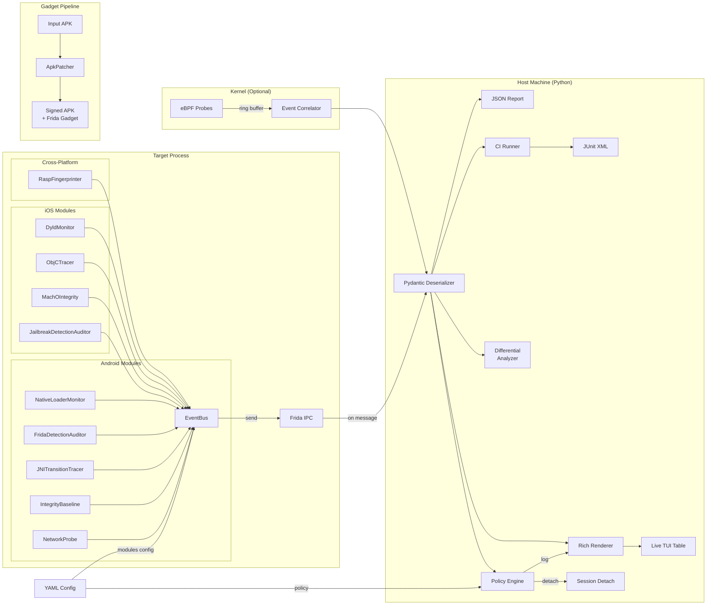

# Sentinellium

A modular Android & iOS instrumentation framework for auditing RASP (Runtime Application Self-Protection) implementations. Built on Frida with optional eBPF kernel probes, Sentinellium hooks into mobile processes at the native layer to evaluate how effectively a RASP SDK detects instrumentation, injection, and tampering.

Designed for security researchers and pentesters who need to assess the coverage and resilience of mobile protection solutions.

## Architecture



**Data flow:** Each agent module hooks specific native functions or scans memory, then emits structured `TelemetryEvent` messages through the `EventBus`. The host deserializes these into Pydantic models, renders them in a live Rich table, and optionally applies RASP policy simulation. Platform detection (`Process.platform`) auto-selects Android or iOS modules. eBPF probes provide kernel-level visibility that Frida alone cannot achieve, while the Gadget pipeline enables auditing apps that block server-mode Frida.

## Module Reference

### Android Modules

| Module | Hook Target | Layer | RASP Feature Audited |
|--------|-------------|-------|---------------------|
| NativeLoaderMonitor | `android_dlopen_ext` | Native/Linker | Tamper detection, library injection |
| FridaDetectionAuditor | `/proc/self/maps`, port scan, trampoline patterns | Native/Proc | Anti-instrumentation |
| JNITransitionTracer | `art::JNI::Call*MethodV` | ART Runtime | Hidden native integrity checks |
| IntegrityBaseline | `.text` section hashing | Native/Memory | Code integrity, anti-patching |
| NetworkProbe | `connect()` in libc | Native/Network | C2 detection, proxy evasion |

### iOS Modules

| Module | Hook Target | Layer | RASP Feature Audited |
|--------|-------------|-------|---------------------|
| DyldMonitor | `dlopen` + `_dyld_register_func_for_add_image` | Dynamic Linker | Library injection, tweak loading |
| ObjCTracer | Selective ObjC method hooks | ObjC Runtime | Jailbreak file checks, URL scheme probing |
| MachOIntegrity | `__TEXT/__text` hashing + `csops` syscall | Mach-O/Kernel | Code signing, binary tampering |
| JailbreakDetectionAuditor | File access, `fork()`, sandbox write, dyld images | Multiple | Jailbreak indicator coverage |

### Cross-Platform

| Module | Technique | RASP Feature Audited |
|--------|-----------|---------------------|
| RaspFingerprinter | Module enumeration, Java class scan, string patterns, behavioral analysis | RASP SDK identification (Wultra, Promon, Guardsquare, Appdome, Talsec, LIAPP, Digital.ai) |

## Quick Start

### Prerequisites

- Python 3.11+
- Node.js 18+
- Frida 16.x (`pip install frida frida-tools`)
- Android device/emulator with `frida-server` running (or iOS device for iOS modules)

### Installation

```bash
# Clone the repository
git clone https://github.com/leinn32/sentinellium.git
cd sentinellium

# Install Python package
pip install -e ".[dev]"

# Build the Frida agent
cd agent && npm install && npm run build && cd ..
```

Optional dependencies:

```bash
# eBPF support (Linux host, root required)
pip install -e ".[ebpf]"

# CI runner
pip install -e ".[ci]"
```

### Usage

```bash
# List available devices
sentinellium devices

# Attach to a running app with live telemetry
sentinellium attach com.target.app

# Spawn and instrument from startup
sentinellium attach com.target.app --spawn

# Attach with eBPF kernel probes (Linux, requires root)
sudo sentinellium attach com.target.app --ebpf

# Run a 30-second scan with JSON report
sentinellium scan com.target.app --duration 30 --output report.json

# Simulate RASP policy responses
sentinellium simulate com.target.app --config config/default.yaml

# Fingerprint which RASP SDK protects the app
sentinellium fingerprint com.target.app

# Differential analysis across emulators
sentinellium diff com.target.app --devices emulator-5554,emulator-5556

# Patch an APK with Frida Gadget
sentinellium gadget patch target.apk --gadget-lib frida-gadget-arm64.so

# Run in CI mode with threshold evaluation
python -m ci.runner --package com.target.app --thresholds ci/thresholds.yaml --junit results.xml
```

Or via Make:

```bash
make scan PKG=com.target.app
make attach PKG=com.target.app
make fingerprint PKG=com.target.app
make simulate PKG=com.target.app
make diff PKG=com.target.app DEVICES=emulator-5554,emulator-5556
make gadget-patch APK=target.apk GADGET_LIB=frida-gadget.so
```

## RASP Relevance

### NativeLoaderMonitor

**Attack vector:** Attackers inject Frida gadgets, Xposed modules, or custom native payloads by loading shared libraries into the target process. On Android 7+, all native library loading goes through `android_dlopen_ext` in the dynamic linker — before `System.loadLibrary` sees anything at the Java layer.

**How RASP handles this:** Products like Wultra's SDK monitor library loading to detect known injection frameworks. They maintain allowlists of expected libraries and flag loads from suspicious paths (e.g., `/data/local/tmp`) or with known signatures (e.g., `frida-agent`).

**What Sentinellium adds:** By hooking at the linker level rather than the Java layer, Sentinellium catches library loads that Java-only RASP monitoring misses. If Sentinellium detects a suspicious load that the RASP SDK doesn't flag, that's a gap in the SDK's native-layer coverage — and a concrete finding for the audit report.

### FridaDetectionAuditor

**Attack vector:** Frida leaves multiple detectable artifacts: memory-mapped agent libraries, listening TCP ports, GLib threads, and inline hook trampolines that replace function prologues with branch instructions.

**How RASP handles this:** RASP SDKs like Wultra's implement multi-layered Frida detection: scanning `/proc/self/maps` for known libraries, probing default ports, checking thread names, and validating function prologues against known hook patterns. The defense-in-depth approach means an attacker must defeat *all* checks to remain undetected.

**What Sentinellium adds:** This module inverts the RASP perspective — instead of detecting Frida to block it, it *scores* how visible Frida is. Running this module produces a detection surface map: "these are the checks that would catch the current Frida setup." This tells a researcher exactly which stealth techniques need improvement and which RASP checks are already effective.

### JNITransitionTracer

**Attack vector:** RASP SDKs implement critical integrity checks (root detection, signature verification, debugger detection) in native code called via JNI. Attackers who can identify these JNI entry points can selectively hook or NOP them to disable RASP protections entirely.

**How RASP handles this:** Wultra's SDK obfuscates its native function names, uses dynamic JNI registration, and implements anti-hook checks around critical functions. The goal is to make it difficult for attackers to enumerate and target specific check functions.

**What Sentinellium adds:** By tracing at the ART JNI layer (`art::JNI::Call*MethodV`), Sentinellium maps *all* JNI transitions regardless of obfuscation or dynamic registration. The output directly tells a researcher "these are the native functions the RASP calls" — revealing the exact attack surface an adversary would target. This is invaluable for evaluating whether the SDK's obfuscation is effective.

### IntegrityBaseline

**Attack vector:** Runtime code patching (via Frida's `Memory.patchCode`, `mprotect` + write, or other instrumentation) modifies executable memory in-place. This is the mechanism behind inline hooking: replace the first few bytes of a function with a branch to attacker-controlled code.

**How RASP handles this:** RASP SDKs compute hashes of their own code sections at startup and periodically re-verify them. If the hash changes, the SDK knows its code has been tampered with and can take defensive action (terminate the app, report to the server, etc.).

**What Sentinellium adds:** This module provides an independent integrity baseline — separate from the RASP SDK's own checks. By comparing hashes from an external vantage point, Sentinellium can validate that the RASP's integrity checking is actually working. It also exposes the race condition window between check intervals: if patches are applied and reverted between checks, the RASP would miss them.

### NetworkProbe

**Attack vector:** Malware and attacker tooling often communicate with command-and-control (C2) servers using raw sockets at the native layer, bypassing Java-level network security policies (NetworkSecurityConfig, OkHttp certificate pinning, etc.).

**How RASP handles this:** Wultra's SDK includes HTTP proxy detection and VPN detection to identify traffic interception. However, native-layer connections that don't use the Java networking stack fall outside these checks.

**What Sentinellium adds:** By hooking `connect()` in libc, this module catches all outgoing TCP connections regardless of the networking library used. The hardcoded-IP heuristic (flagging connections without preceding DNS resolution) specifically targets C2 channels that hardcode server addresses — a common malware pattern that evades domain-based detection.

### RaspFingerprinter

**Attack vector:** Before auditing a RASP implementation, you need to know *which* RASP SDK is in play. Different vendors use different detection strategies, and knowing the SDK version and vendor lets you prioritize your audit approach.

**How RASP handles this:** RASP vendors attempt to hide their identity through obfuscation, but inevitably leave fingerprints: native library names, Java class paths, string constants in memory, and behavioral patterns (e.g., TracerPid checks, specific thread naming conventions).

**What Sentinellium adds:** The RaspFingerprinter combines four scanning layers — native module enumeration, Java class scanning, `/proc/self/maps` string matching, and behavioral analysis — to identify the RASP SDK with a confidence score. It recognizes Wultra, Promon SHIELD, Guardsquare DexGuard/iXGuard, Appdome, Talsec freeRASP, LIAPP, and Digital.ai (Arxan). This accelerates the audit setup phase: instead of manual reverse engineering, you get an immediate answer with actionable metadata.

### DyldMonitor (iOS)

**Attack vector:** On iOS, attackers inject tweaks and instrumentation libraries via the dynamic linker (`dyld`). MobileSubstrate, Substitute, ElleKit, and libhooker all work by loading dylibs into the target process, either through `DYLD_INSERT_LIBRARIES` or dyld interposing.

**How RASP handles this:** iOS RASP SDKs monitor `dlopen` calls and the dyld image list to detect unexpected libraries. They maintain blocklists of known tweak injection paths (`/Library/MobileSubstrate/`, `/usr/lib/TweakInject/`).

**What Sentinellium adds:** By hooking both `dlopen` and registering a `_dyld_register_func_for_add_image` callback, the DyldMonitor catches library loads that bypass the `dlopen` path entirely (e.g., lazy binding, framework dependencies). This is more comprehensive than monitoring `dlopen` alone and reveals gaps in RASP dyld coverage.

### ObjCTracer (iOS)

**Attack vector:** iOS RASP SDKs heavily use Objective-C APIs for runtime checks — `NSFileManager` for jailbreak file detection, `UIApplication` for URL scheme probing, `NSProcessInfo` for environment variable inspection. Attackers who can intercept these calls can feed false responses.

**How RASP handles this:** RASP SDKs call these APIs from native code or through obfuscated wrappers to make interception harder. Some implement method swizzling detection on critical selectors.

**What Sentinellium adds:** The ObjCTracer uses `ObjC.implement()` to selectively replace method implementations for configured class/selector pairs, logging every invocation. Unlike hooking `objc_msgSend` globally (which is extremely noisy), this targeted approach provides clean, actionable traces of exactly which runtime checks the RASP performs.

### MachOIntegrity (iOS)

**Attack vector:** Attackers patch Mach-O binaries on disk or modify executable pages in memory to disable RASP checks. Code signing validation (`csops` syscall) is the primary defense.

**How RASP handles this:** iOS RASP SDKs verify the `CS_VALID` flag via the `csops` syscall and hash their own `__TEXT` sections to detect tampering. The App Store's FairPlay DRM adds another integrity layer.

**What Sentinellium adds:** Independent verification of code signing status and `__TEXT/__text` section hashing provides a second opinion on the RASP's own integrity checks. The module also parses `LC_CODE_SIGNATURE` load commands to validate the Mach-O signature structure directly.

### JailbreakDetectionAuditor (iOS)

**Attack vector:** Jailbreaking removes iOS sandboxing restrictions, enabling arbitrary code injection and file system access. RASP SDKs treat jailbreak detection as a prerequisite for all other protections.

**How RASP handles this:** RASP SDKs implement multiple jailbreak indicators: file existence checks (Cydia, Sileo, checkra1n files), URL scheme probing, sandbox escape tests, `fork()` availability, and dyld image inspection.

**What Sentinellium adds:** This module runs the same 6-category check suite that RASP SDKs use, producing a coverage map: "which indicators does the target device trigger?" On a jailbroken device, comparing Sentinellium's findings against what the RASP reports reveals blind spots — indicators the RASP doesn't check or checks incorrectly.

### eBPF Kernel Monitoring

**Attack vector:** Sophisticated attackers operate below the Frida injection layer — using kernel modules, direct `mmap` with `PROT_EXEC`, or `ptrace`-based injection. These techniques are invisible to userspace-only monitoring.

**How RASP handles this:** Enterprise RASP solutions increasingly incorporate kernel-level telemetry, but most mobile RASP SDKs remain userspace-only due to iOS restrictions and Android's SELinux policies.

**What Sentinellium adds:** The eBPF subsystem attaches tracepoints to `sys_enter_openat`, `sys_enter_mmap` (filtered to `PROT_EXEC`), `sys_enter_execve`, and `sys_enter_ptrace`. The EventCorrelator cross-references eBPF events with Frida telemetry in a 5-second sliding window, flagging `stealth_lib_load` (critical) when the kernel observes a library load that Frida missed — direct evidence of a detection gap.

### Gadget Automation

**Attack vector:** When apps successfully detect and block Frida server-mode attachment, the alternative is repackaging the APK with Frida Gadget embedded. This changes the app's signature but bypasses server-detection checks.

**How RASP handles this:** RASP SDKs verify the APK signature at runtime (via `PackageManager.signatures`), check for Frida Gadget artifacts, and validate that the app wasn't decompiled/recompiled (apktool leaves detectable markers).

**What Sentinellium adds:** The automated gadget pipeline (decode → inject .so → Smali patch → config → rebuild → align → sign) demonstrates the full attacker workflow. By automating it, researchers can rapidly test whether the RASP SDK detects each stage: the repackaging itself, the gadget library presence, and the modified startup flow. This is the systematic approach to evaluating anti-tampering resilience.

### Differential Analysis

**Attack vector:** Android fragmentation means RASP behavior can vary significantly across API levels. ART symbol changes (Android 13-15 progressively restricted JNI symbol visibility), `/proc` access restrictions (Android 11+), and linker namespace tightening (Android 12+) all affect detection capabilities.

**How RASP handles this:** RASP SDK vendors maintain compatibility matrices and version-specific code paths. However, regressions in new Android versions are common and often undiscovered until production deployment.

**What Sentinellium adds:** Differential analysis runs parallel scans across multiple emulators (each running a different Android version) and produces a comparison matrix showing where detection capabilities diverge. Built-in `VERSION_NOTES` explain known API-level-specific issues, so the audit output directly answers: "Did our JNI tracing break on Android 14?"

## Configuration

Configuration is loaded from YAML files. The agent auto-detects the platform and loads appropriate modules:
- `config/default.yaml` — Android defaults
- `config/strict.yaml` — Aggressive Android settings
- `config/ios-default.yaml` — iOS defaults

Key configuration concepts:

- **Module enable/disable:** Each module can be independently toggled
- **Suspicious paths/patterns:** Customizable allowlists for the NativeLoaderMonitor / DyldMonitor
- **Integrity interval:** How frequently the IntegrityBaseline re-checks (tradeoff: sensitivity vs. overhead)
- **ObjC targets:** Class/selector pairs for the ObjCTracer
- **Private ranges:** CIDR ranges considered local for the NetworkProbe
- **Policy actions:** Map severity levels to `"detach"` (simulate app kill) or `"log"` (observe only)

```yaml
modules:
  native-loader:
    enabled: true
    suspicious_patterns: ["frida", "xposed", "magisk"]
  rasp-fingerprint:
    enabled: true
  integrity:
    enabled: true
    interval_seconds: 2  # More aggressive checking
policy:
  critical: "detach"
  warning: "log"
```

## Project Structure

```
sentinellium/
  agent/
    src/
      core/
        hook-module.ts        # HookModule interface + BaseHookModule with error boundary
        event-bus.ts           # Typed send() wrapper, enforces TelemetryEvent schema
        index.ts               # Module registry, platform detection, RPC exports
      modules/
        native-loader.ts       # NativeLoaderMonitor (Android)
        frida-detection.ts     # FridaDetectionAuditor (Android)
        jni-tracer.ts          # JNITransitionTracer (Android)
        integrity.ts           # IntegrityBaseline (Android)
        network-probe.ts       # NetworkProbe (Android)
        rasp-fingerprint.ts    # RaspFingerprinter (cross-platform)
        ios/
          dyld-monitor.ts      # DyldMonitor (iOS)
          objc-tracer.ts       # ObjCTracer (iOS)
          macho-integrity.ts   # MachOIntegrity (iOS)
          jailbreak-detection.ts # JailbreakDetectionAuditor (iOS)
    tsconfig.json
    package.json
  host/
    __init__.py
    cli.py                     # Click CLI: attach/scan/fingerprint/diff/gadget/simulate
    device.py                  # Frida device enumeration, session lifecycle
    renderer.py                # Rich Live table rendering, report formatting
    models.py                  # Pydantic models: TelemetryEvent, ScanReport, Config
    differential.py            # Differential analysis across Android versions
  gadget/
    __init__.py
    patcher.py                 # APK decode → inject → patch → rebuild → align → sign
    config_gen.py              # Frida Gadget JSON config generator
    signer.py                  # Debug keystore + apksigner/zipalign wrappers
    templates/
      gadget-config.json       # Template gadget configuration
  ebpf/
    __init__.py
    loader.py                  # eBPF probe lifecycle: attach, PID filter, detach
    ring_buffer.py             # Ring buffer consumer: BPF → TelemetryEvent conversion
    correlator.py              # Cross-reference eBPF + Frida events in sliding window
    probes/
      file_monitor.bpf.c       # sys_enter_openat tracepoint
      lib_load.bpf.c           # sys_enter_mmap (PROT_EXEC filter)
      process_monitor.bpf.c    # sys_enter_execve + sys_enter_ptrace
  ci/
    __init__.py
    runner.py                  # CI scan runner with threshold evaluation
    Dockerfile                 # Multi-stage CI image with emulator
    entrypoint.sh              # Emulator boot + scan orchestration
    github_action.yaml         # Reusable GitHub Action definition
    thresholds.yaml            # Default pass/fail thresholds
  config/
    default.yaml               # Android default configuration
    strict.yaml                # Aggressive settings for thorough audits
    ios-default.yaml           # iOS default configuration
    rasp-signatures.yaml       # RASP SDK fingerprint signatures
  tests/
    agent/
      native-loader.test.ts    # Path matching logic, telemetry event shape
    host/
      test_models.py           # Pydantic deserialization, risk scoring
      test_renderer.py         # Summary formatting, event display
      test_differential.py     # DiffResult computation, finding generation
      test_ci_runner.py        # Threshold evaluation, JUnit XML generation
      test_gadget.py           # Gadget config generation, manifest parsing
  demo/
    README.md                  # Step-by-step demo instructions
    expected-output.txt        # Example Rich table output
  Makefile
  pyproject.toml
  README.md
```

## Testing

```bash
# Run all tests
make test

# Agent tests only (vitest)
make test-agent

# Host tests only (pytest)
make test-host
```

## Sample Output

```
┌──────────────────────────────────────────────────────────────────────┐
│                    Risk Score — com.target.app                       │
│                            75/100                                    │
│                         Duration: 30s                                │
└──────────────────────────────────────────────────────────────────────┘

┏━━━━━━━━━━━━━━━━━━━━┯━━━━━━━┯━━━━━━━━━━┯━━━━━━━━━┯━━━━━━┓
┃ Module             │ Total │ Critical │ Warning │ Info ┃
┡━━━━━━━━━━━━━━━━━━━━┿━━━━━━━┿━━━━━━━━━━┿━━━━━━━━━┿━━━━━━┩
│ rasp-fingerprint   │   1   │    0     │    0    │  1   │
│ frida-detection    │   6   │    1     │    4    │  1   │
│ integrity          │   3   │    1     │    0    │  2   │
│ jni-tracer         │   3   │    0     │    2    │  1   │
│ native-loader      │   5   │    1     │    0    │  4   │
└────────────────────┴───────┴──────────┴─────────┴──────┘

RASP SDK Detected: Wultra In-App Protection (confidence: 85%)
```

## Limitations & Future Work

### Current Limitations

- **Frida is itself detectable.** This is the fundamental bootstrapping problem: Sentinellium uses Frida to audit RASP, but well-implemented RASP will detect and block Frida before the agent can run. The Gadget pipeline mitigates this by embedding Frida inside the APK, but the repackaged signature is itself detectable.

- **Packed/obfuscated APKs.** Apps using packers (e.g., Bangcle, Tencent Legu, Qihoo 360) execute from dynamically unpacked memory regions. The JNITransitionTracer may not resolve meaningful method names from obfuscated symbols. Unpacking the APK before analysis would provide better results.

- **Integrity hashing race condition.** The IntegrityBaseline module checks at configurable intervals (default 5s). Patches applied and reverted between checks go undetected. Reducing the interval increases detection sensitivity but adds CPU overhead to the target app.

- **eBPF requires root + Linux host.** The eBPF probes need a Linux kernel >= 5.8 with BTF support and root access. This limits kernel-level monitoring to rooted test environments. Not available on macOS/Windows hosts.

- **iOS testing requires jailbreak.** Frida server-mode attachment on iOS requires a jailbroken device. Non-jailbroken testing is limited to Gadget injection on development builds.

- **Network module noise.** The NetworkProbe is disabled by default because native `connect()` hooking on Android generates enormous volumes of events from system services. Production use requires per-UID filtering.

- **Gadget pipeline changes app signature.** Repackaging with apktool and re-signing with a debug key changes the APK signature, which many RASP SDKs detect. This is a known trade-off: you gain Frida access but trigger signature-based checks.

### Future Work

- **Windows/macOS agent modules** for desktop RASP auditing
- **ARM64e PAC support** for iOS 15+ pointer authentication monitoring
- **Automated RASP bypass generation** from audit findings
- **Web dashboard** for multi-device fleet scan visualization
- **RASP signature community database** with crowdsourced indicators

## License

MIT
